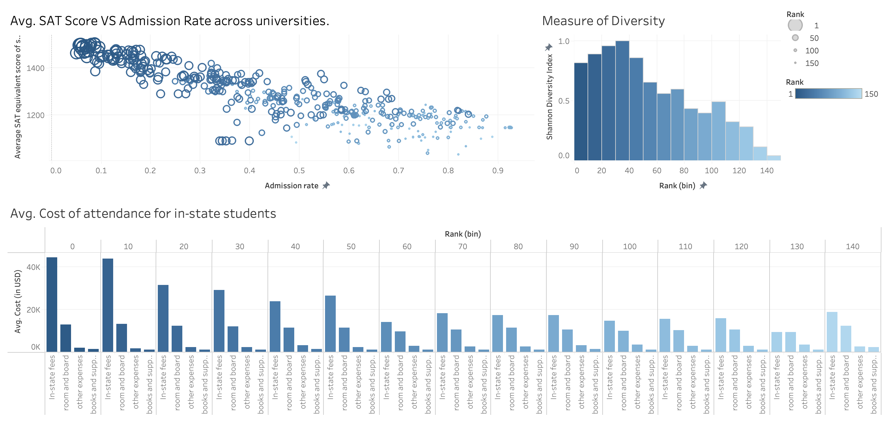

# visualizing-institutional-rankings
DS 650 Data Visualization : Visualizing Institutional Rankings

## Objective
This project aims to create an interactive dashboard for analyzing university rankings using various key metrics. The dashboard leverages data visualization techniques to help prospective students and their families make informed decisions about higher education institutions. The visualizations include university admission rates, SAT scores, financial information, student demographics, and other relevant data points.

You can check the [visualizations](./Visualizations) and the [report](./Deliverable_1.pdf).

## Visualization Tasks
1. **Diversity Across University Ranks**
   - Bar Chart vs. Stacked Bar Chart

2. **Admission Rates vs. SAT Scores**
   - Bar Chart vs. Scatter Plot

3. **University Cost Components**
   - Stacked Bar Chart vs. Heatmap

4. **Financial Aid Distribution**
   - Line Graph vs. Stacked Bar Chart

5. **Retention Rates Across Ranks**
   - Scatter Plot vs. Line Chart

6. **In-state vs. Out-of-state Fees**
   - Line Chart vs. Bar Chart

7. **Proportion of Independent and Dependent Students**
   - Stacked Bar Chart Scaled to 100% vs. Side-by-Side Bar Chart

## Interactive Dashboard
The interactive dashboard integrates these visualizations to provide a comprehensive tool for analyzing university rankings. Users can interact with the dashboard to filter data by rank, view specific metrics, and compare universities across various dimensions. The dashboard is designed to be user-friendly, allowing for easy exploration and decision-making.
